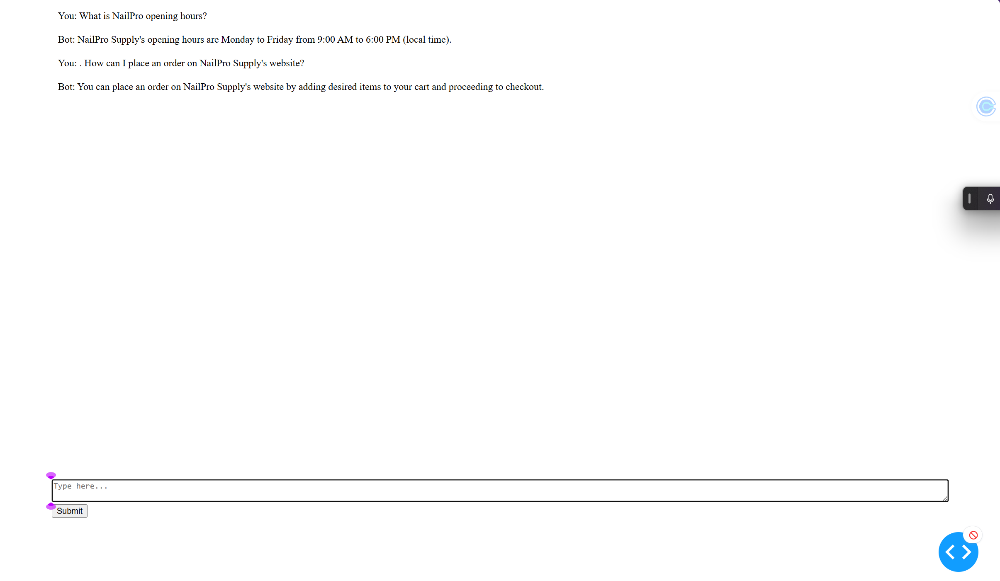

# Chatbot Application

Welcome to the Chatbot Application project, a complete AI-powered chatbot solution featuring a robust backend and an intuitive frontend. This project demonstrates the seamless integration of machine learning capabilities and user-friendly interfaces, making it an excellent addition to any portfolio.

---

## **Overview**

This project consists of two main components:

1. **Backend (`Chatbot` folder):**
   - Handles document indexing, query processing, and integration with the vector store for efficient responses.
   - Built with Python and includes utilities for handling PDFs, FAQs, and other document formats.

2. **Frontend (`ChatbotUI` folder):**
   - Provides an interactive interface for users to engage with the chatbot.
   - Built with Dash, offering responsive design and real-time communication with the backend.

---

## **Features**

### **Backend Features**
- **Document Indexing**: Supports processing and indexing of documents (e.g., PDFs).
- **FAQ Handling**: Efficient FAQ vector store for quick and accurate responses.
- **API Integration**: Serves as the foundation for seamless communication with the frontend.
- **Modular Design**: Configurable settings using `config.py` and `.env` files.

### **Frontend Features**
- **Interactive UI**: A sleek and user-friendly interface for engaging with the chatbot.
- **Real-Time Interaction**: Facilitates real-time responses using state management tools.
- **Customizable Design**: Easily adjustable styles for a tailored user experience.
- **Error Handling**: Alerts users to invalid inputs or backend connection issues.

---

## **Technologies Used**

- **Backend**:
  - Python
  - Flask/Dash
  - Vector Store Libraries

- **Frontend**:
  - Dash Framework
  - HTML/CSS for styling
  - REST API for backend integration

---

## **Setup Instructions**

### **Prerequisites**
- Python 3.8+
- Node.js (optional, for additional UI tooling)

### **Installation**
1. Clone the repository:
   ```bash
   git clone https://github.com/yourusername/chatbot.git
   cd chatbot
   ```

2. Install dependencies for the backend:
   ```bash
   pip install -r requirements.txt
   ```

3. Set up environment variables:
   - Create a `.env` file in the `chatbot` folder with the required configuration:
     ```
     BACKEND_SERVER_URL=http://127.0.0.1
     BACKEND_SERVER_PORT=5000
     ```

4. Start the backend server:
   ```bash
   python chatbot/server.py
   ```

5. Navigate to the `ChatbotUI` folder and install frontend dependencies:
   ```bash
   cd ChatbotUI
   npm install  # Optional, if using additional Node.js-based tools
   ```

6. Start the frontend:
   ```bash
   python app.py
   ```

---

## **Usage**

1. Launch the application by running the backend and frontend servers as described above.
2. Open your web browser and navigate to:
   ```
   http://127.0.0.1:5500
   ```
3. Interact with the chatbot by entering your queries and receiving intelligent responses.

---

## **Folder Structure**

```
chatbot/
├── chatbot/               # Backend code
│   ├── config.py          # Configuration settings
│   ├── server.py          # Main server script
│   ├── indexing.py        # Document indexing utilities
│   ├── schemas.py         # Data models
│   ├── utils.py           # Helper functions
│   └── documents/         # Input documents (e.g., PDFs)
├── chatbot-ui/            # Frontend code
│   ├── app.py             # Main UI script
│   ├── styles.py          # UI styling
│   └── config.py          # Frontend configuration
├── .env                   # Environment variables
├── README.md              # Project documentation
└── requirements.txt       # Python dependencies
```

---

## **Screenshot**

Below is an example of the Chatbot UI in action:



---

## **Contributing**

We welcome contributions to enhance the functionality and design of this chatbot application! To contribute:

1. Fork the repository.
2. Create a new branch for your feature or bug fix:
   ```bash
   git checkout -b feature-name
   ```
3. Commit your changes and push to your fork:
   ```bash
   git commit -m "Description of changes"
   git push origin feature-name
   ```
4. Open a pull request on the main repository.

---

## **License**

This project is licensed under the MIT License. See the `LICENSE` file for details.

---

## **Contact**

For questions, feedback, or collaboration opportunities, feel free to reach out:

- **Email**: miracle5284@users.noreply.github.com
- **GitHub**: [Miracle Mayowa Adebunmi](https://github.com/miracle5284)
